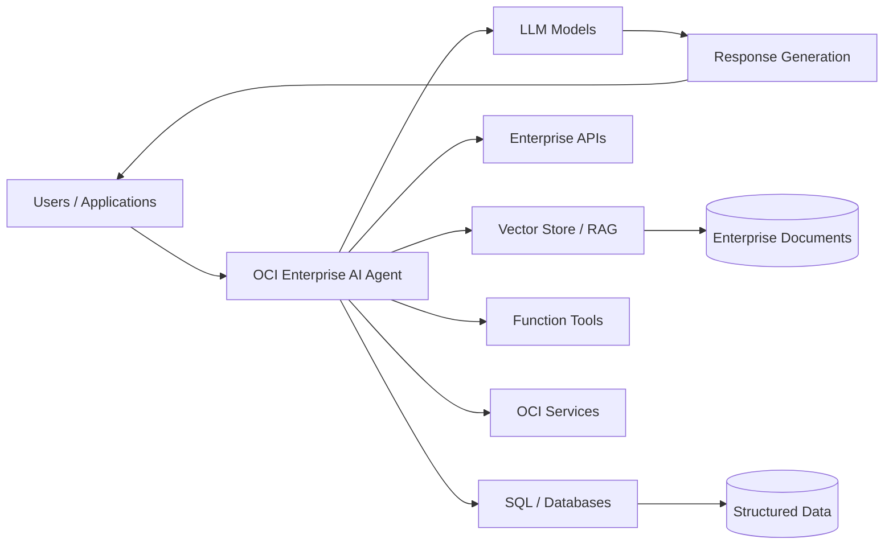
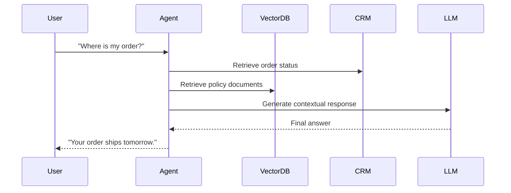
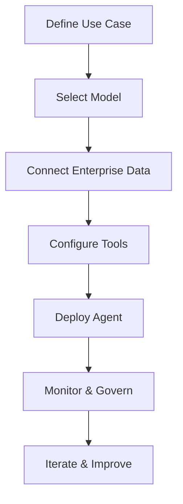

# Oracle Enterprise AI Agents (OCI Generative AI)

## Overview

Oracle Enterprise AI Agents is part of **Oracle Cloud Infrastructure (OCI) Generative AI** and provides a managed platform for building, deploying, and governing production-grade AI agents for enterprise workloads.

It enables organizations to create intelligent agents that can:

- Understand natural language
- Reason over enterprise data
- Use tools and APIs
- Execute workflows
- Retrieve information using RAG (Retrieval-Augmented Generation)
- Interact with structured and unstructured data
- Maintain conversational context and memory

Oracle positions Enterprise AI Agents as an **enterprise-grade agentic AI platform** with built-in governance, scalability, security, and OCI-native integrations.

---

# Key Capabilities

## 1. OCI Responses API

The OCI Responses API is the core API for agentic workflows.

Features include:

- OpenAI-compatible API format
- Multi-model routing
- Tool orchestration
- Reasoning workflows
- Conversation memory
- Function calling
- File search
- Code interpreter support

This allows developers to reuse existing OpenAI SDK patterns while running workloads securely inside OCI.

---

## 2. Hosted Agentic Applications

OCI also supports deploying fully hosted agentic applications.

Capabilities include:

- Managed runtime
- Agent deployment infrastructure
- Integrated vector stores
- Built-in observability
- IAM and governance controls
- Enterprise security policies
- OCI-native scaling

This reduces operational overhead for teams deploying enterprise AI solutions.

---

## 3. Enterprise RAG

Enterprise AI Agents support Retrieval-Augmented Generation (RAG).

Typical workflow:

1. Enterprise documents are ingested
2. Content is chunked and embedded
3. Embeddings are stored in vector stores
4. Relevant context is retrieved dynamically
5. LLM generates grounded responses

Supported data sources include:

- Object Storage
- Databases
- Enterprise APIs
- Files
- External systems

This improves factual accuracy and reduces hallucinations. 

---

## 4. Tool Use and Workflow Automation

Agents can invoke tools during execution:

- Function calling
- SQL execution
- File search
- Code interpreter
- MCP tools
- External APIs

This enables AI agents to move beyond chat into operational workflows and automation.

---

## 5. Enterprise Governance and Security

OCI Enterprise AI Agents include enterprise-grade controls:

- OCI IAM integration
- Private networking
- Auditability
- Guardrails
- Data governance
- Sovereign AI deployment options
- Zero data retention endpoints

These features help enterprises deploy AI securely at scale.

---

# High-Level Architecture

---

# Example Enterprise Workflow

## Customer Support AI Agent

---

# OCI Enterprise AI Agent Components

| Component | Purpose |
|---|---|
| OCI Responses API | Agent orchestration and execution |
| LLM Models | Reasoning and language generation |
| Vector Stores | RAG retrieval |
| Memory | Context retention |
| Function Calling | Tool execution |
| SQL Tools | Structured data access |
| Guardrails | Safety and governance |
| OCI IAM | Identity and access control |
| Hosted Runtime | Managed deployment |

---

# Why Enterprises Use OCI Enterprise AI Agents

## Benefits

### Faster Development
- OpenAI-compatible APIs
- Managed infrastructure
- Built-in tooling

### Enterprise Security
- OCI-native governance
- IAM integration
- Data isolation

### Reduced Operational Complexity
- Managed scaling
- Hosted runtimes
- Integrated observability

### Multi-Model Flexibility
Supports models from providers including:
- OpenAI
- xAI
- Google
- Cohere
- Meta (depending on OCI region/services)

citeturn0search3turn0search8

---

# Common Enterprise Use Cases

- Customer support agents
- Internal knowledge assistants
- IT operations copilots
- HR assistants
- Procurement automation
- Financial analysis agents
- Document intelligence
- Workflow orchestration
- NL2SQL analytics assistants

---

# OCI Enterprise AI Agent Lifecycle

---

# Key Differentiators

| OCI Enterprise AI Agents | Typical DIY AI Stack |
|---|---|
| Managed infrastructure | Self-managed infrastructure |
| Integrated security/governance | Custom security implementation |
| OpenAI-compatible APIs | Varies |
| OCI-native integrations | Manual integrations |
| Built-in vector stores/tools | Additional components required |
| Enterprise-grade deployment model | Custom operational model |

---

# Summary

Oracle Enterprise AI Agents provides an enterprise-ready platform for building AI-powered agents on OCI using managed infrastructure, agent orchestration APIs, enterprise security, and integrated AI tooling.

It combines:
- LLM access
- RAG
- tool orchestration
- memory
- governance
- enterprise integrations

into a unified platform for production-grade AI applications.

---

# References

- Oracle Documentation — Enterprise AI Agents in OCI Generative AI
- Oracle Documentation — OCI Generative AI
- Oracle Documentation — Generative AI Agents
- Oracle AI Platform Documentation

Sources:
- https://docs.oracle.com/en-us/iaas/Content/generative-ai/agents.htm
- https://docs.oracle.com/en-us/iaas/Content/generative-ai/home.htm
- https://docs.oracle.com/en-us/iaas/Content/generative-ai-agents/home.htm
